# sysHUB Findr
Dokumentation zum sysHUB Findr. Weitere Informationen über aktuelle Änderungen sind im [Changelog](CHANGELOG.md) zu finden. Informationen zur Mitarbeit in dem Projekt gibt es im Abschnitt [Contributing](CONTRIBUTING.md).

## Work in progress
Diese Software befindet sich noch in der Entwicklung. Sie basiert auf dem [COSMOSFindr aus Version 2.9.1](https://cdegitlab.westeurope.cloudapp.azure.com/sfuchs/COSMOSFindr) der aber durch viele Änderungen in sysHUB und der REST API hinfällig wurde. Der sysHUBFindr ist der generalüberholte Findr mit modernen Webkomponenten und einem neuen Outfit auf Grundlage des Material Design von Google.

## Voraussetzungen
Um diese Software nutzen zu können und dürfen ist folgendes erforderlich:
- NT-ware uniFLOW sysHUB ab Version 2022.1.0
- sysHUB Lizenz REST API

## Erforderliche Berechtigung für Anwender
Nutzer des Findr müssen im sysHUB mindestens die folgenden Berechtigungen besitzen:
- Rolle gem. Vorgabe Authorisierungsserver
- Permission PERM_IADMINSERVICE_GETWORKFLOWITEM: Erforderlich für die Ausführung des Workflows der die Suchanfrage bearbeitet und das sysHUB durchsucht.
- Permission ...

## Konfiguration
Die Konfiguration für ein Kundensystem erfolgt vorrangig in der `environment.prod.ts` (siehe [src\environments](src\environments)). Sofern die Datei nicht existiert, erzeuge eine Kopie der `environment.prod.template.ts` und der `environment.template.ts` und entferne jeweils das `.template` aus dem Dateinamen.

In der Datei müssen entweder Basic- oder OAuth Credentials angegeben und anschließend muss das gesamte Projektverzeichnis kompiliert werden (siehe [Contributing Guide - Abschnitt Build](CONTRIBUTING.md#build)). Durch die direkte Einbindung in den Source code lädt die Seite schneller, mit weniger HTTP-Anfragen und ohne nachträgliches Rendering.

### Konfigurationsparameter
| Parameter | Werte (Default) | Verwendung und Hinweise |
| --- | --- | --- |
| production | `true` oder `false` | **Niemals ändern.** Immer `true` in der `environment.prod.ts` und immer `false` in der `environment.ts`. |
| app.baseUrl | String (`/findr/`) | Der relative Pfad über den die Webapp vom Webserver ausgeliefert wird. Heißt der Ordner innerhalb von `webapps` `findr`, so muss der Name auch in `app.baseUrl` angegeben sein (mit führenden und abschließendem `/`). |
| app.promotionLink | Url (`""`) | Beliebige Url. Ist dieser Parameter nicht leer, wird in der Titelzeile des Findr rechts neben dem Suchsymbol ein Link zu dieser Url angezeigt. Im Standard ist es der Link zum Findr Sourcecode. |
| app.minPhraseLength | Numerisch (`3`) | Beliebige Zahl. Mindestanzahl an Zeichen die im Suchfeld eingegeben sein müssen, bevor die Suche auch ausgeführt wird. |
| i10n.fallback | String (`en`) | Beliebiger gültiger Sprachcode zweistellig. Der Findr enthält Übersetzungsdateien [siehe Lokalisierung](#lokalisierung-i10n) für Deutsch (`de`) und Englisch (`en`). Fordert der Browser eine andere Sprache an, wird die Fallback-Sprache geliefert, die durch diesen Parameter bestimmt wird. |
| storage. ... | String | Alle Einträge innerhalb des `storage`-Objekts definieren Speicherpfade im Browsercache. **Nicht verändern.** |
| syshub.host | Url (`http://localhost:8088/`) | Basis-Url zur Syshub-Installation. Immer sicherstellen das ein abschließender `/` gesetzt ist. Diese Url ist die Basis für die Anmeldung am sysHUB und auch die Aufrufe gegen die Rest-API. |
| syshub.basic.enabled | `true` oder `false` (`false`) | Definiert, ob sich die Webseite per Basic-Authentifizierung am sysHUB Host anmeldet. Wenn `true` müssen die folgenden drei Parameter username, password und provider befüllt sein. |
| syshub.basic.username | String (`""`) | Name des Useraccounts der die Berechtigung zur Anmeldung am sysHUB besitzt. Die erforderliche Rolle wird im sysHUB API Server (gem. nachfolgendem Parameter provider) festgelegt. |
| syshub.basic.password | String (`""`) | Zugehöriges Passwort für den Useraccount. |
| syshub.basic.provider | String (`""`) | Name eines registrierten API Server im sysHUB (Scope `private;public` erforderlich) |
| syshub.oauth.enabled | `true` oder `false` (`false`) | Definiert, ob sich die Webseite per OAUTH2-Authentifizierung am sysHUB Host anmeldet. Wenn `true` müssen die folgenden beiden Parameter clientId und clientSecret befüllt sein. Nutzer der Webseite werden vor der ersten Suche aufgefordert sich anzumelden. |
| syshub.oauth.clientId | String (`findr`) | Name eines im sysHUB konfigurierten Authorisierungsserver (Scope `private;public` erforderlich, Resource Ids `cosmos-web;cosmos-webapi` erforderlich) |
| syshub.oauth.clientSecret | String (`...`) | Das zur Client Id zugehörige secret. |

### Lokalisierung (I10N)

### Sucheinstellungen auf der Startseite

## Vorschau auf die Funktionalitäten

### Startseite
Die Startseite dient der Konfiguration einer Suchanfrage. Die Suchanfrage wird für das nächste mal im Browsercache gespeichert. Das Suchfeld in der obersten Navigationsleiste bietet jederzeit den schnellsten Weg eine weitere Suche zu starten (Einstellungen der vorherigen Suche werden übernommen).

| Desktopansicht | Mobile Ansicht |
| --- | --- |
|  | 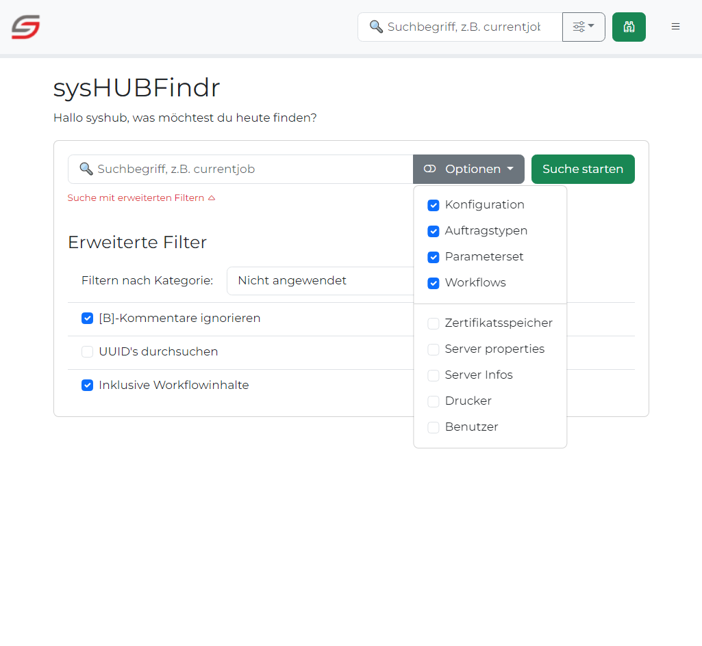 |

### Suche läuft
Nachdem die Suche gestartet wird, wird der Anwender auf eine Seite zum Status der Suche weitergeleitet. Diese wird zusammen mit einem sich bewegenden Balken angezeigt, bis das Ergebnis der Suche vom sysHUB zurückgemeldet und aufbereitet wurde.

| Desktopansicht | Mobile Ansicht |
| --- | --- |
|  |  |

### Ergebnis-Zusammenfassung
Sobald das Suchergebnis verarbeitet wurde, wird dem Anwender eine Zusammenfassung angezeigt. In der Trefferliste werden jeweils für Konfiguration, Parameterset, Auftragstypen und Workflows listenartig dargestellt, welche Treffer ermittelt wurden. In dieser Zusammenfassung gibt es für Konfiguration und Parameterset keine Baumdarstellung.

An jeder Stelle der Ergebnisse werden Treffer innerhalb eines Wertes mit einem blassen gelb hinterlegt.

über die zweite Navigationsleiste (oberhalb der Trefferliste) springt der Anwender in die jeweilige Detailansicht.

| Desktopansicht | Mobile Ansicht |
| --- | --- |
|  | 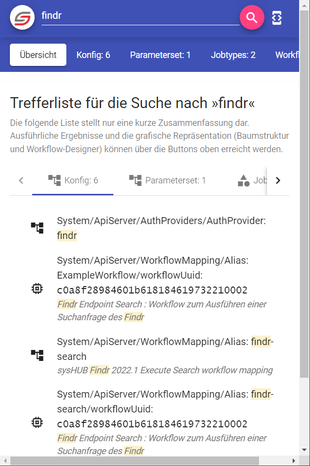 |
| 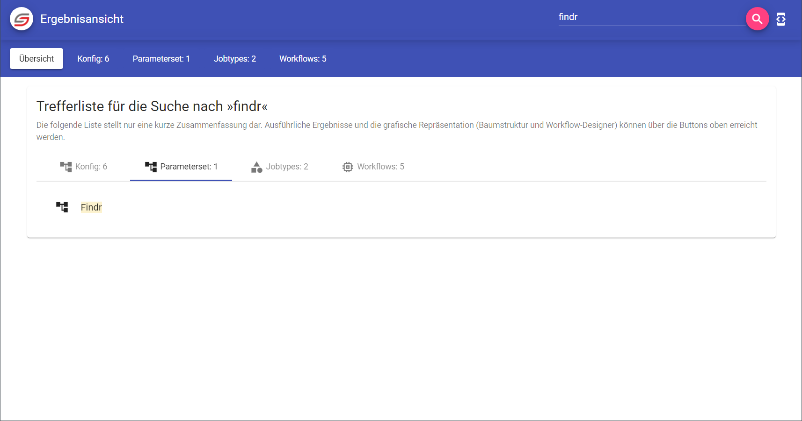 | 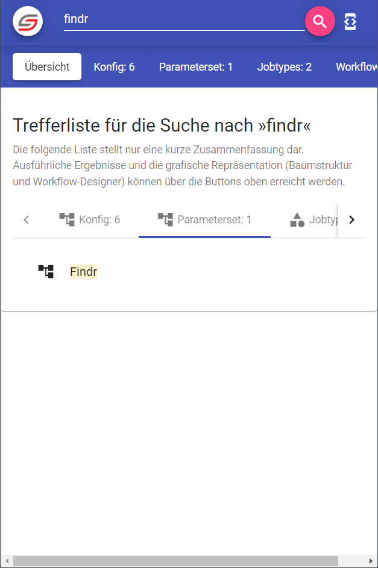 |
| 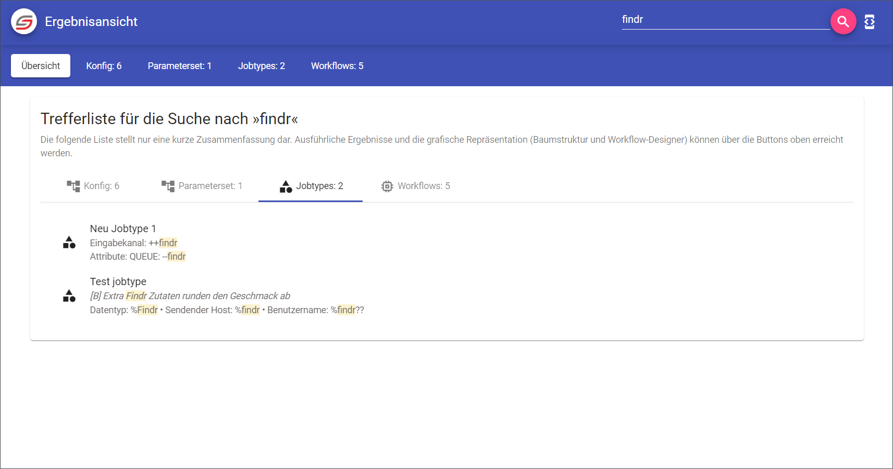 | 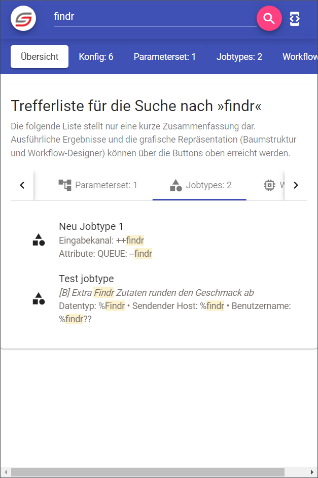 |
|  | 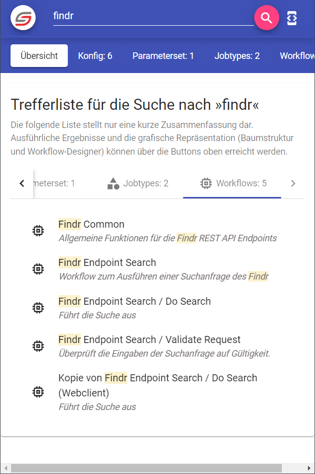 |

### Ergebnisansicht Konfiguration und Parametersets
Nach einem Klick auf Konfig oder Parameterset in der zweiten Navigationsleiste wird die jeweilige detaillierte Ergebnisansicht geladen. Dabei wird für Konfig wie auch für Parametersets die komplette Baumstruktur dargestellt. Alle Knoten in denen mindestens ein Treffer gefunden wurde sind automatisch aufgeklappt und mit einem grünen Icon versehen. Die Icons in der Baumstruktur repräsentieren den Datentyp. 

In der rechten Spalte (mobile Ansicht oberhalb) werden alle Details zu einem Eintrag angezeigt, sobald der Cursor sich über einen Eintrag der Baumstruktur bewegt.
Klickt der Anwender die weiße Pinnadel bei den Details oder einen Eintrag in der Baumstruktur an, wird dieser Eintrag angepinnt und das Bewegen des Maus Cursors wählt kein anderes Element automatisch mehr aus. Im angepinnten Modus (ersichtlich an der blauen Pinnadel) ist es möglich beliebig durch die Baumstruktur zu scrollen, ohne den gewählten Eintrag aus dem Blick zu verlieren.

Mit einem Klick auf das Copy-Icon neben einem Detaileintrag kann der Wert kopiert werden.

| Desktopansicht | Mobile Ansicht |
| --- | --- |
|  | 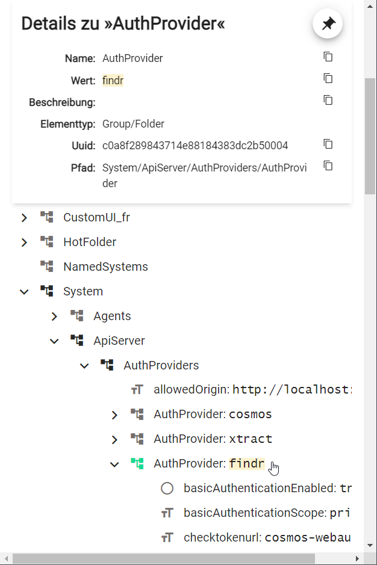 |
|  | 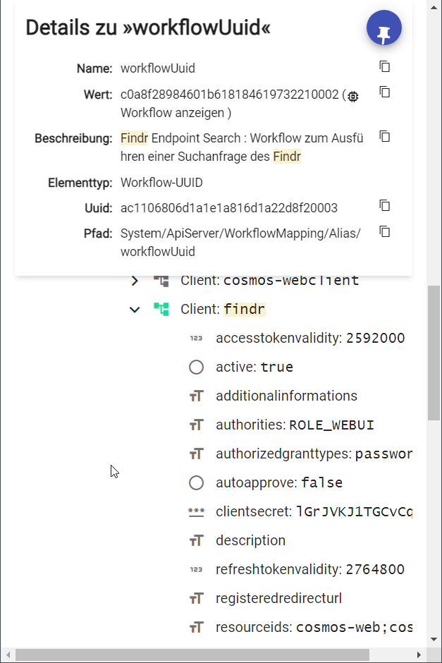 |

### Ergebnisansicht Auftragstypen
Die Ergebnisansicht der Auftragstypen ist nur wenig anders, als die der Konfig. Es gibt natürlich keine Baumstruktur, stattdessen werden die Elemente als Liste dargestellt. Wie auch bei Konfig und Parameterset gibt es im rechten Bereich die Detailinformationen zu einem Auftragstypen inkl. der Jobattribute-Klassifizierung.

| Desktopansicht | Mobile Ansicht |
| --- | --- |
| 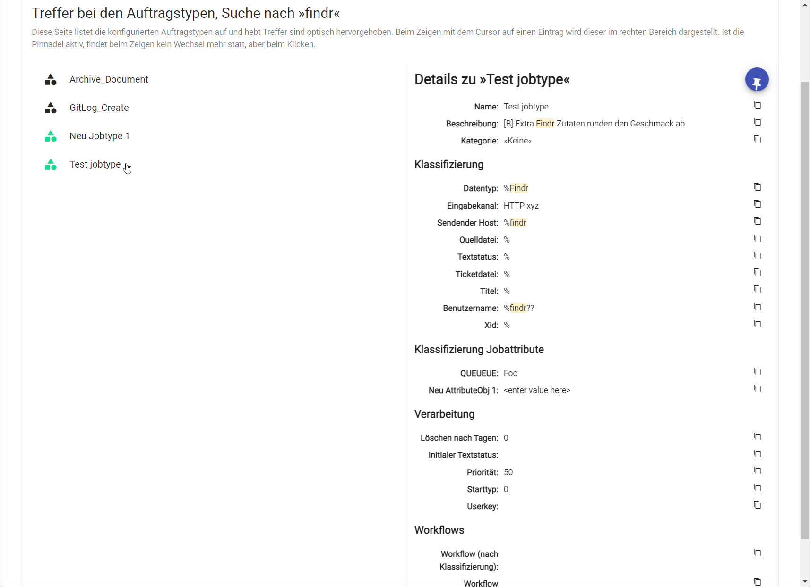 | 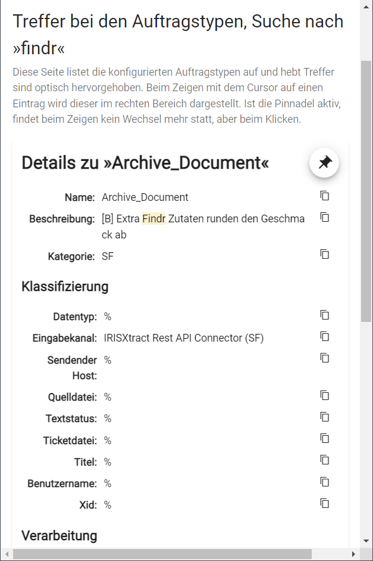 |
