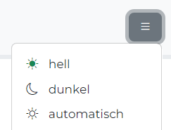
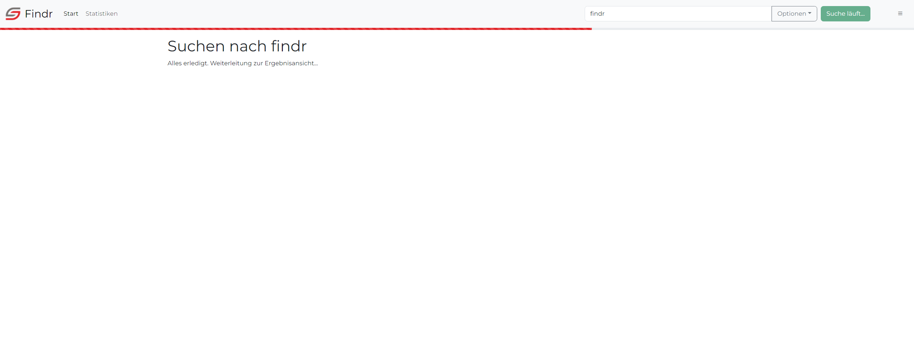
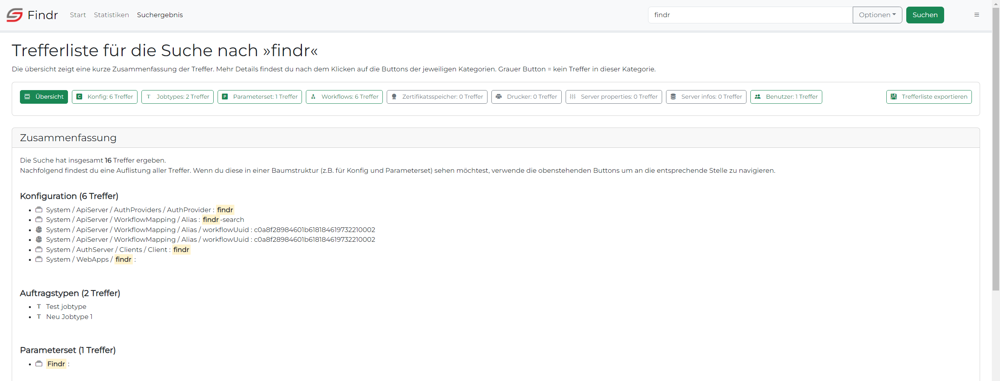
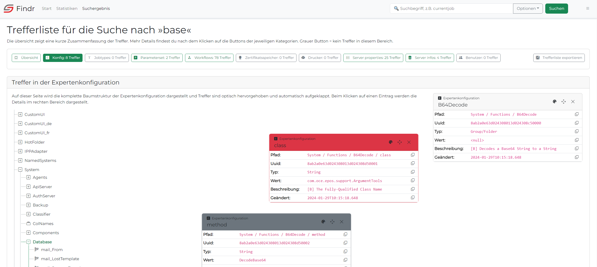
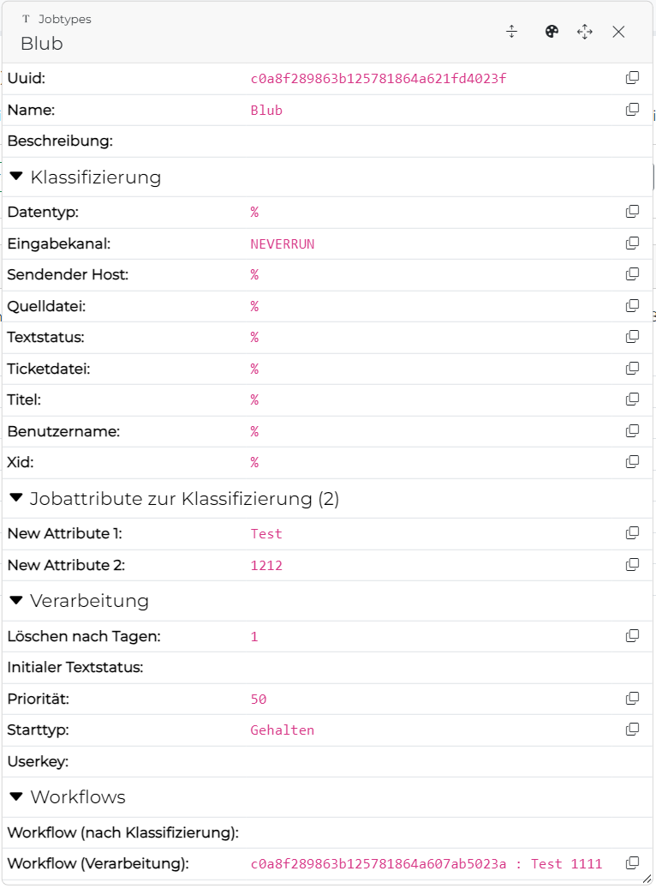
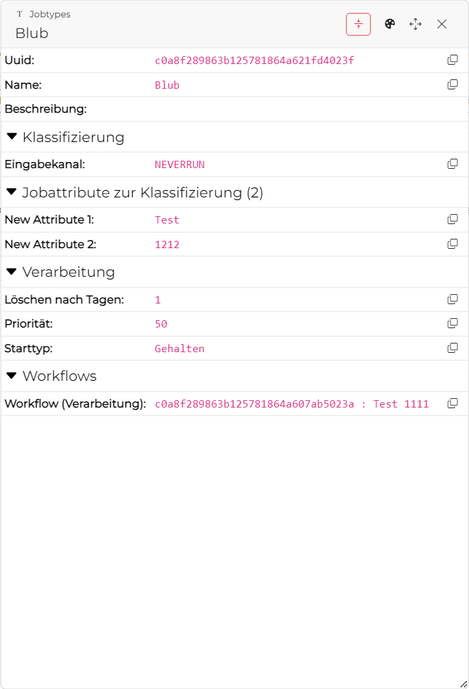

# sysHUB Findr
Dokumentation zum sysHUB Findr. Weitere Informationen über aktuelle Änderungen sind im [Changelog](CHANGELOG.md) zu finden. Informationen zur Mitarbeit in dem Projekt gibt es im Abschnitt [Contributing](CONTRIBUTING.md).

## ⚠️ Work in progress
Diese Software befindet sich noch in der Entwicklung. Sie basiert auf dem [COSMOSFindr aus Version 2.9.1](https://cdegitlab.westeurope.cloudapp.azure.com/sfuchs/COSMOSFindr) der aber durch viele Änderungen in sysHUB und der REST API hinfällig wurde. Der sysHUBFindr ist der generalüberholte Findr mit modernen Webkomponenten und einem neuen Outfit auf Grundlage des Material Design von Google.

## Voraussetzungen
Um diese Software nutzen zu können und dürfen ist folgendes erforderlich:
- NT-ware uniFLOW sysHUB ab Version 2022.1.0
- sysHUB Lizenz REST API

## Erforderliche Berechtigung für Anwender ⚠️ 
Nutzer des Findr müssen im sysHUB mindestens die folgenden Berechtigungen besitzen:
- Rolle gem. Vorgabe Authorisierungsserver
- Permission PERM_IADMINSERVICE_GETWORKFLOWITEM: Erforderlich für die Ausführung des Workflows der die Suchanfrage bearbeitet und das sysHUB durchsucht.
- Permission ...

## Konfiguration (Work in progress [see #3](https://github.com/surcoufx83/sysHUB-Findr/issues/3))
Die Konfiguration für ein Kundensystem erfolgt vorrangig in der `environment.prod.ts` (siehe [src\environments](src\environments)). Sofern die Datei nicht existiert, erzeuge eine Kopie der `environment.prod.template.ts` und der `environment.template.ts` und entferne jeweils das `.template` aus dem Dateinamen.

In der Datei müssen entweder Basic- oder OAuth Credentials angegeben und anschließend muss das gesamte Projektverzeichnis kompiliert werden (siehe [Contributing Guide - Abschnitt Build](CONTRIBUTING.md#build)). Durch die direkte Einbindung in den Source code lädt die Seite schneller, mit weniger HTTP-Anfragen und ohne nachträgliches Rendering.

### Konfigurationsparameter
| Parameter                 | Werte (Default)                                                          | Verwendung und Hinweise                                                                                                                                                                                                                                                                                                                                                         |
| ------------------------- | ------------------------------------------------------------------------ | ------------------------------------------------------------------------------------------------------------------------------------------------------------------------------------------------------------------------------------------------------------------------------------------------------------------------------------------------------------------------------- |
| production                | `true` oder `false`                                                      | **Niemals ändern.** Immer `true` in der `environment.prod.ts` und immer `false` in der `environment.ts`.                                                                                                                                                                                                                                                                        |
| app.baseUrl               | String (`/findr/`)                                                       | Der relative Pfad über den die Webapp vom Webserver ausgeliefert wird. Heißt der Ordner innerhalb von `webapps` `findr`, so muss der Name auch in `app.baseUrl` angegeben sein (mit führenden und abschließendem `/`).                                                                                                                                                          |
| app.promotionLink         | Url (`""`)                                                               | Beliebige Url. Ist dieser Parameter nicht leer, wird in der Titelzeile des Findr rechts neben dem Suchsymbol ein Link zu dieser Url angezeigt. Im Standard ist es der Link zum Findr Sourcecode.                                                                                                                                                                                |
| app.minPhraseLength       | Numerisch (`3`)                                                          | Beliebige Zahl. Mindestanzahl an Zeichen die im Suchfeld eingegeben sein müssen, bevor die Suche auch ausgeführt wird.                                                                                                                                                                                                                                                          |
| i10n.fallback             | String (`en`)                                                            | Beliebiger gültiger Sprachcode zweistellig. Der Findr enthält Übersetzungsdateien [siehe Lokalisierung](#lokalisierung-i10n) für Deutsch (`de`) und Englisch (`en`). Fordert der Browser eine andere Sprache an, wird die Fallback-Sprache geliefert, die durch diesen Parameter bestimmt wird.                                                                                 |
| storage. ...              | String                                                                   | Alle Einträge innerhalb des `storage`-Objekts definieren Speicherpfade im Browsercache. **Nicht verändern.**                                                                                                                                                                                                                                                                    |
| syshub.host               | Url (`http://localhost:8088/`)                                           | Basis-Url zur Syshub-Installation. Immer sicherstellen das ein abschließender `/` gesetzt ist. Diese Url ist die Basis für die Anmeldung am sysHUB und auch die Aufrufe gegen die Rest-API.                                                                                                                                                                                     |
| syshub.basic.enabled      | `true` oder `false` (`false`)                                            | Definiert, ob sich die Webseite per Basic-Authentifizierung am sysHUB Host anmeldet. Wenn `true` müssen die folgenden drei Parameter username, password und provider befüllt sein.                                                                                                                                                                                              |
| syshub.basic.username     | String (`""`)                                                            | Name des Useraccounts der die Berechtigung zur Anmeldung am sysHUB besitzt. Die erforderliche Rolle wird im sysHUB API Server (gem. nachfolgendem Parameter provider) festgelegt.                                                                                                                                                                                               |
| syshub.basic.password     | String (`""`)                                                            | Zugehöriges Passwort für den Useraccount.                                                                                                                                                                                                                                                                                                                                       |
| syshub.basic.provider     | String (`""`)                                                            | Name eines registrierten API Server im sysHUB (Scope `private;public` erforderlich)                                                                                                                                                                                                                                                                                             |
| syshub.oauth.enabled      | `true` oder `false` (`false`)                                            | Definiert, ob sich die Webseite per OAUTH2-Authentifizierung am sysHUB Host anmeldet. Wenn `true` müssen die folgenden beiden Parameter clientId und clientSecret befüllt sein. Nutzer der Webseite werden vor der ersten Suche aufgefordert sich anzumelden.                                                                                                                   |
| syshub.oauth.clientId     | String (`findr`)                                                         | Name eines im sysHUB konfigurierten Authorisierungsserver (Scope `private;public` erforderlich, Resource Ids `cosmos-web;cosmos-webapi` erforderlich)                                                                                                                                                                                                                           |
| syshub.oauth.clientSecret | String (`...`)                                                           | Das zur Client Id zugehörige secret.                                                                                                                                                                                                                                                                                                                                            |
| syshub.oauth.scope        | String (`'private' \| 'public' \| 'private+public' \| 'public+private'`) | Das scope, so wie im Client konfiguriert. Für den Findr muss im sysHUB `private;public` konfiguriert werden. Daher muss dieser Parameter entweder als `private+public` oder `public+private` gesetzt sein.  ⚠️Ist OAuth aktiviert und dieser Parameter nicht korrekt konfiguriert, wird eine Fehlermeldung angezeigt und sämtliche Suchfunktionen im Findr sind deaktiviert. |

### Theme

Der Findr enthält einen automatischen Design-Wechsel zwischen hellem und dunklem Modus abhängig von den Benutzerpräferenzen, eingestellt im Betriebssystem. über das Bürger-Menü rechts oben kann durch den Benutzer auch manuell ein Thema festgelegt werden.
 

### Lokalisierung (L10N)

 Der Findr ist übersetzt in die Sprachen Deutsch, Englisch, Französisch. Beim Laden der Seite bestimmt die Browser-Standardeinstellung (i.d.R. = Betriebssystem-Sprache), welche Sprache angezeigt wird. Anwender können über das Bürger-Menü rechts oben eine andere Sprache auswählen.
 

### Sucheinstellungen auf der Startseite
Über die Startseite können Sucheinstellungen vorgenommen werden, die über die Suche in der Navigationsleiste aus Platzgründen nicht verfügbar sind. Diese zusätzlichen Einstellungen sind im Findr als "erweiterte Filter" bezeichnet. In diese sind folgende Optionen enthalten:
- Suchen nur in Elementen die einer Kategorie zugeordnet sind
- `[B]`-Kommentare ignorieren (Standard-Kommentare in Prozessen und Beschreibungstexten)
- UUID's durchsuchen
- Inklusive Workflowinhalte

In den Findr Standardeinstellungen sind diese wie folgt gesetzt:
- Kategorie-Filter: deaktiviert
- `[B]`-Kommentare ignorieren: aktiviert
- UUID's durchsuchen: deaktiviert
- Inklusive Workflowinhalte: aktiviert

Werden diese Einstellungen durch den Anwender auf der Startseite geändert und dann eine Suche ausgeführt, so werden diese Einstellungen für den Anwender als neuer Standard im Browser gespeichert. Ebenso verwendet die Suche in der Navigationsleiste zukünftig diese Einstellungen.

## Vorschau auf die Funktionalitäten

### Anmeldeseite ⚠️ 

### Startseite
Die Startseite dient der Konfiguration einer Suchanfrage. Die Suchanfrage wird für das nächste mal im Browsercache gespeichert. Das Suchfeld in der obersten Navigationsleiste bietet jederzeit den schnellsten Weg eine weitere Suche zu starten (Einstellungen der vorherigen Suche werden übernommen).

### Suche läuft
Nachdem die Suche gestartet wird, wird der Anwender auf eine Seite zum Status der Suche weitergeleitet. Diese wird zusammen mit einem sich bewegenden Balken angezeigt, bis das Ergebnis der Suche vom sysHUB zurückgemeldet und aufbereitet wurde.
Wurde bei der Suche eine der Optionen Zertifikatsspeicher, Server properties, Server infos, Drucker oder Benutzer gewählt, führt das dazu, dass nach der herkömlichen Suche die entsprechenden Rest API Endpoints aufgerufen und untersucht werden.

### Ergebnis-Zusammenfassung  
Sobald das Suchergebnis verarbeitet wurde, wird dem Anwender eine Zusammenfassung angezeigt. In der Trefferliste werden jeweils für Konfiguration, Parameterset, Auftragstypen, Workflows, Zertifikatsspeicher, Server properties, Server infos, Drucker und Benutzer listenartig dargestellt, welche Treffer ermittelt wurden. In dieser Zusammenfassung gibt es für Konfiguration und Parameterset keine Baumdarstellung.

An jeder Stelle der Ergebnisse werden Treffer innerhalb eines Wertes mit einem blassen gelb hinterlegt.

Über die Navigationsleiste (oberhalb der Zusammenfassung) springt der Anwender in die jeweilige Detailansicht. Die Buttons sind ausgegraut dargestellt, wenn in dem Bereich der Suchbegriff nicht gefunden wurde. 
Zusätzlich lässt sich die Trefferliste exportieren. Der Export enthält eine Json-Datei welche die Suchanfrage inkl. der Ergebnisse beinhaltet. Der Export kann zum Beispiel zu Diagnosezwecken in einem anderen Findr importiert werden.

In der Zusammenfassung der Suchergebnisse sind für jedes Thema mit Treffer die Elemente aufgelistet. In dieser Ansicht gibt es keine Baumstruktur oder Ergebnisdetails, es soll ausschließlich eine Kurzzusammenfassung bieten. Für detaillierte Informationen bitte auf den Button für das entsprechende Thema klicken.

### Ergebnisansicht Konfiguration und Parametersets 
Die Expertenkonfiguration und die Parametersets werden in einer Baumstruktur dargestellt. Zweige die einen Treffer enthalten sind automatisch aufgeklappt. Über die `+`- und `-`-Symbole in der Baumstruktur können beliebige andere Ordner aufgeklappt werden. Elemente die keine Unterelemente enthalten, haben ein Symbol das dem gewählten Datentyp entspricht.

Nach dem Klick auf den Namen oder Wert eines Eintrags, öffnet sich ein kleines Eigenschaftenfenster auf der rechten Seite. Je nach Bildschirmauflösung können mehrere Fenster dargestellt werden. Diese Fenster können farblich eingefärbt, frei auf der Seite verschoben und vertikal verkleinert und vergrößert werden. Mit dem `X`-Icon wird das Fenster geschlossen.

**In der 📱 mobilen Ansicht gibt es kein Eigenschaftenfenster!**

Die Eigenschaftenfenster enthalten jeweils neben einem Wert immer auch ein kleines `Copy`-Icon. Wird darauf geklickt, so wird der Textinhalt der Eigenschaft (z.B. die Uuid) in die Zwischenablage übernommen.

### Weitere Ergebnisansichten ⚠️ 
Die Ergebnisansicht der Auftragstypen, Workflows, etc stellen mögliche Elemente und Treffer in einer sortierten Liste dar. Nach dem Klick auf einen Listeneintrag wird auch wieder ein zusätzliches Eigenschaftenfenster dargestellt. 

Je nach Thema weitere Funktionen in der Titelleiste des Zusatzfensters. Für Jobtypen gibt es eine Funktion um Einträge die nur ein `%` enthalten oder leer sind, auszublenden. Da Jobtypen sehr viele Eigenschaften für die Klassifizierung enthalten, bei denen die meisten Werte nur dem Prozentzeichen entsprechen, erhöht sich mit aktivem Filter die Übersichtlichkeit. Die Filtereinstellung wird im Browser gespeichert und bleibt auch nach dem Schließen des Browsers erhalten.

Wie auch im sysHUB Client sind die Eigenschaften thematisch gruppiert (Klassifizierung, Jobattribute, Verarbeitung, Workflows). Diese Gruppen können zu- und auch wieder aufgeklappt werden um mehr Platz zu sparen. Standardmäßig sind alle Gruppen immer aufgeklappt.

    
    

## Ergebnisliste exportieren und importieren ⚠️ 

## Fehlerdiagnose Findr ⚠️

### Findr deaktiviert
Wird in einem roten Banner die Meldung "Findr deaktiviert!" angezeigt, bedeutet das schlicht, dass in der [Konfiguration](#konfigurationsparameter) für OAuth entweder kein `syshub.oauth.scope` oder ein unzureichender Wert angegeben wurde.
Damit der Findr alle Aufgaben erfüllen kann, benötigt er Zugriff auf die öffentlichen wie auch internen Rest API Endpunkte. Erreicht wird das, in dem beim das scope auf `private+public` gesetzt wird (bzw. `public+private`) und im sysHUB im Autorisierungsserver `private;public` oder bei Basic Auth im Api-Server.

Ohne den Zugriff auf die internen Endpunkte ("private"), ist kein Abruf des Konfig- und des ParametersetB-Baums möglich.

#### Beheben der Meldung:
1. Bei OAuth:
   1. In der sysHUB Expertenkonfiguration im Bereich Autorisierungsserver den Oauth-Client wählen und prüfen dass Scope `private;public` oder `public;private` ist. Falls nicht, ändern.
   2. In der `environment.prod.ts` ebenfalls den Wert eintragen unter `api.syshub.oauth.scope`. Hier wird allerdings statt des `;` ein `+`-Zeichen erwartet.
   3. Neu kompilieren und testen.
2. Bei Basic Auth:

   *Stand 8.2.24: sysHUB prüft das Scope bei Basic auth nicht. Es gibt also aktuell nichts zu tun.*
