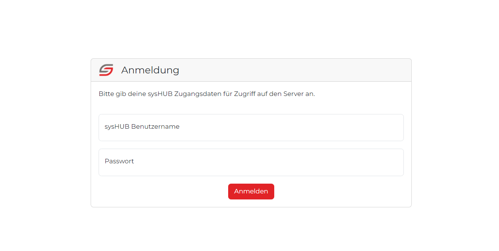
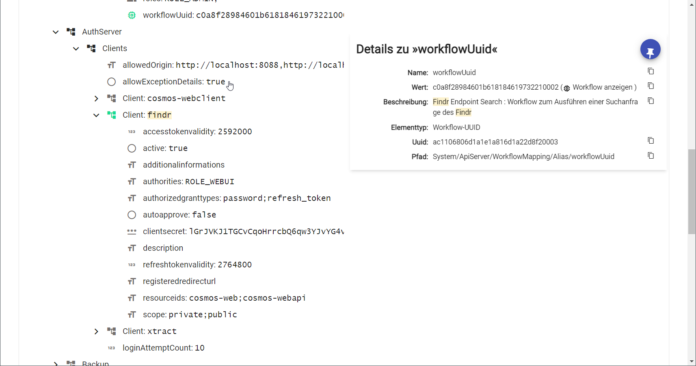
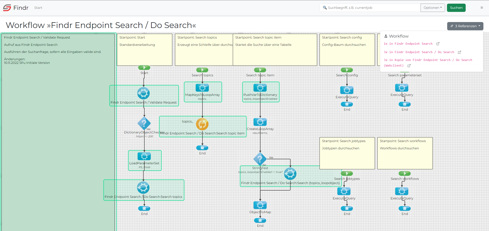
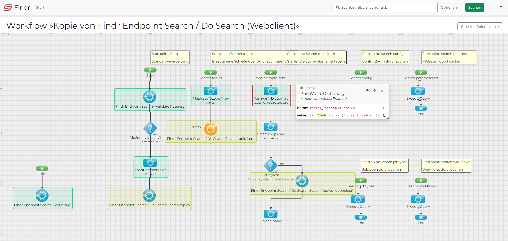

# sysHUB Findr
Dokumentation zum sysHUB Findr. Weitere Informationen über aktuelle Änderungen sind im [Changelog](CHANGELOG.md) zu finden. Informationen zur Mitarbeit in dem Projekt gibt es im Abschnitt [Contributing](CONTRIBUTING.md).

## ⚠️ Work in progress
Diese Software befindet sich noch in der Entwicklung. Sie basiert auf dem [COSMOSFindr aus Version 2.9.1](https://cdegitlab.westeurope.cloudapp.azure.com/sfuchs/COSMOSFindr) der aber durch viele Änderungen in sysHUB und der REST API hinfällig wurde. Der sysHUBFindr ist der generalüberholte Findr mit modernen Webkomponenten und einem neuen Outfit auf Grundlage des Angular Frameworks.

## Voraussetzungen
Um diese Software nutzen zu können und dürfen ist folgendes erforderlich:
- NT-ware uniFLOW sysHUB Version 2023.1.0 (der Findr ist sofern möglich abwärtskompatibel bis 2022, aber mit eingeschränkter Funktionalität)
- sysHUB Lizenz REST API

## Erforderliche Berechtigung für Anwender
Nutzer des Findr müssen im sysHUB mindestens die folgenden Berechtigungen besitzen:
- `PERM_IADMINSERVICE_GETSERVERINFOS`: Erforderlich zum Abrufen der sysHUB Server properties
- `PERM_IADMINSERVICE_GETWORKFLOWITEMS`, `PERM_IADMINSERVICE_GETWORKFLOWITEM`: Erforderlich für die Ausführung des Workflows der die Suchanfrage bearbeitet und das sysHUB durchsucht sowie Details und Design der Workflows.
- `PERM_IEPOSSERVER_GETINFORMATIONLIST`: Erforderlich zum Abrufen einer Liste von IPP Devices und Server-Infos
- `PERM_RESTAPI_CERTIFICATE_READ`: Erforderlich zum Abrufen des Certstore
- `PERM_RESTAPI_USER_READ`: Erforderlich zum Abrufen aller Benutzer
- `PERM_RESTAPI_USER_READSELF`: Erforderlich um Details (wie den Benutzernamen) des angemeldeten Benutzers zu ermitteln.
- `PERM_RESTAPI_USER_READSELF`: Erforderlich um Details (wie den Benutzernamen) des angemeldeten Benutzers zu ermitteln.
- Unbekannte weitere Berechtigungen für den Abruf von Kategorien, Expertenkonfiguration, Parameterset, Benutzerrollen. Diese sind nicht dokumentiert.

## Konfiguration

### Webapp Konfiguration
Die Konfiguration für ein Kundensystem erfolgt in der Datei `webapps\findr\assets\config\config.json`. Diese Datei ist im Auslieferungszustand nicht vorhanden und muss erzeugt werden. Als Vorlage dient die `config.json.template` im gleichen Verzeichnis.

1. Eine Kopie des Templates anlegen und als `config.json` benennen.
2. In der `config.json` folgende Werte anpassen:
   1. Zeile 4: `host` anpassen zum Hostnamen des sysHUB-Systems dessen Rest API aufgerufen wird.
   2. In Zeile 5: `version` ändern in:
      - `2` = sysHUB 2022
      - `3` = sysHUB 2023
   3. Ab Zeile 6: `basic` aktivieren und mit Zugangsdaten befüllen, sofern ein sysHUB API Server mit basic Authentifizierung verendet wird.
   4. Ab Zeile 12: `oauth` aktivieren und mit Zugangsdaten befüllen, sofern ein sysHUB Authorisierungsserver verwendet wird.
   5. `basic` und `oauth` dürfen nicht zusammen aktiv sein, entweder oder.
   6. Zeile 22: `promotionLink` kann im Findr ausgeblendet werden, wenn der Link entfernt wird und nur `""` bleibt

### Konfiguration im sysHUB

1. Die `Findr_1.0.ppk` importieren.
2. Je nach Bedarf den API Server oder Authorisierungsserver findr konfigurieren und entsprechend in der `config.json` anpassen. Nicht benötigtes kann deaktiviert werden.
3. Den Ordner `webapps\findr` in das sysHUB Verzeichnis kopieren. Eine evtl. vorhandene findr-webapp vorher entfernen.
4. Bei Neuinstallation den sysHUB neustarten.

### Theme

Der Findr enthält einen automatischen Design-Wechsel zwischen hellem und dunklem Modus abhängig von den Benutzerpräferenzen, eingestellt im Betriebssystem. über das Bürger-Menü rechts oben kann durch den Benutzer auch manuell ein Thema festgelegt werden.
 

### Lokalisierung (L10N)

 Der Findr ist übersetzt in die Sprachen Deutsch, Englisch, Französisch. Beim Laden der Seite bestimmt die Browser-Standardeinstellung (i.d.R. = Betriebssystem-Sprache), welche Sprache angezeigt wird. Anwender können über das Bürger-Menü rechts oben eine andere Sprache auswählen.
 

### Sucheinstellungen auf der Startseite

Über die Startseite können Sucheinstellungen vorgenommen werden, die über die Navigationsleiste aus Platzgründen nicht verfügbar sind. Diese zusätzlichen Einstellungen sind im Findr als "erweiterte Filter" bezeichnet und enthalten enthalten:
- `[B]`-Kommentare ignorieren (Standard-Kommentare in Prozessen und Beschreibungstexten)
- UUID's durchsuchen
- Inklusive Workflowinhalte

In den Findr Standardeinstellungen sind diese wie folgt gesetzt:
- `[B]`-Kommentare ignorieren: aktiviert
- UUID's durchsuchen: deaktiviert
- Inklusive Workflowinhalte: aktiviert

Werden diese Einstellungen durch den Anwender auf der Startseite geändert und dann eine Suche ausgeführt, so werden diese Einstellungen für den Anwender als neuer Standard im Browser gespeichert. Ebenso verwendet die Suche in der Navigationsleiste zukünftig diese Einstellungen.

## Vorschau auf die Funktionalitäten

### Anmeldeseite 

Die Anmeldeseite wird angezeigt, wenn ein Anwender den Findr mit aktiviertem OAuth aufruft und sich nicht zuvor angemeldet hat. Der Login erfordert gültige sysHUB Zugangsdaten. Nach erfolgter Anmeldung wird der Anwender auf die Startseite weitergeleitet.

### Startseite
Die Startseite dient der Konfiguration einer Suchanfrage. Die Suchanfrage wird für das nächste mal im Browsercache gespeichert. 

Das Suchfeld in der oberen Navigationsleiste bietet den schnellsten Weg eine weitere Suche zu starten und verwendet immer die letzten Sucheinstellungen der Startseite.

### Suche läuft
Nachdem die Suche gestartet wird, wird der Anwender auf eine Seite zum Status der Suche weitergeleitet. Diese wird zusammen mit einem sich bewegenden Balken angezeigt, bis das Ergebnis der Suche vom sysHUB zurückgemeldet und aufbereitet wurde.
Wurde bei der Suche eine der Optionen Zertifikatsspeicher, Server properties, Server infos, Drucker oder Benutzer gewählt, führt das dazu, dass nach der herkömlichen Suche die entsprechenden Rest API Endpoints aufgerufen und untersucht werden.

### Ergebnis-Zusammenfassung  
Sobald das Suchergebnis verarbeitet wurde, wird dem Anwender eine Zusammenfassung angezeigt. In der Trefferliste werden jeweils für Konfiguration, Parameterset, Auftragstypen, Workflows, Zertifikatsspeicher, Server properties, Server infos, Drucker und Benutzer listenartig dargestellt, welche Treffer ermittelt wurden. In dieser Zusammenfassung gibt es für Konfiguration und Parameterset keine Baumdarstellung.

An jeder Stelle der Ergebnisse werden Treffer innerhalb eines Wertes mit einem blassen gelb hinterlegt.

Über die Navigationsleiste (oberhalb der Zusammenfassung) springt der Anwender in die jeweilige Detailansicht. Die Buttons sind ausgegraut dargestellt, wenn in dem Bereich der Suchbegriff nicht gefunden wurde. 
Zusätzlich lässt sich die Trefferliste exportieren. Der Export enthält eine Json-Datei welche die Suchanfrage inkl. der Ergebnisse beinhaltet. Der Export kann zum Beispiel zu Diagnosezwecken in einem anderen Findr importiert werden.

In der Zusammenfassung der Suchergebnisse sind für jedes Thema mit Treffer die Elemente aufgelistet. In dieser Ansicht gibt es keine Baumstruktur oder Ergebnisdetails, es soll ausschließlich eine Kurzzusammenfassung bieten. Für detaillierte Informationen bitte auf den Button für das entsprechende Thema klicken.

### Ergebnisansicht Konfiguration und Parametersets 
Die Expertenkonfiguration und die Parametersets werden in einer Baumstruktur dargestellt. Zweige die einen Treffer enthalten sind automatisch aufgeklappt. Über die `+`- und `-`-Symbole in der Baumstruktur können beliebige andere Ordner aufgeklappt werden. Elemente die keine Unterelemente enthalten, haben ein Symbol das dem gewählten Datentyp entspricht.

Beim Zeigen mit der Maus auf den Namen oder Wert eines Eintrags, öffnet sich ein kleines Eigenschaftenfenster. Mit einem Mausklick auf den Namen oder Wert des Eintrags, wird es angepinnt und kann beliebig verschoben werden. Mit dem `X`-Icon wird das Fenster geschlossen.

**Einschränkung in der 📱 mobilen Ansicht**

Da es auf mobilen Geräten keinen Mauszeiger gibt, klappt auch das Zeigen auf einen Konfigurationseintrag nicht. Das Eigenschaftenfenster kann per Klick geöffnet werden.

### Weitere Ergebnisansichten
Die Ergebnisansicht der Auftragstypen, Workflows, etc stellen mögliche Elemente und Treffer in einer sortierten Liste dar. Wie auch in der Baumstruktur ist das Eigenschaftenfenster verfügbar.

Je nach Thema enthält die Titelleiste des Zusatzfensters weitere Funktionen. Für Jobtypen gibt es eine Funktion um Einträge die nur ein `%` enthalten oder leer sind, auszublenden. Da Jobtypen sehr viele Eigenschaften für die Klassifizierung enthalten, bei denen die meisten Werte nur dem Prozentzeichen entsprechen, erhöht sich mit aktivem Filter die Übersichtlichkeit. Die Filtereinstellung wird im Browser gespeichert und bleibt auch nach dem Schließen des Browsers erhalten. Bei Workflows ist ein Link vorhanden, der den Workflow im Designer anzeigt.

Wie auch im sysHUB Client sind die Eigenschaften thematisch gruppiert (Klassifizierung, Jobattribute, Verarbeitung, Workflows). Diese Gruppen können zu- und auch wieder aufgeklappt werden um mehr Platz zu sparen. Standardmäßig sind alle Gruppen immer aufgeklappt.

    
    

### Workflow Viewer

Ein Klick auf den Link Workflow öffnen oder das entsprechende Icon in einem der Eigenschaftsfenster öffnet den Workflow Viewer in einem neuen Browser-Tab. Treffer sind auch hier grün hervorgehoben. Je nach sysHUB-Version stehen rechts über dem Workflow noch Dropdowns zur Verfügung, die Workflow Versionen und Workflow Referenzen auflisten. Mauszeiger über eines der Workflow-Elemente (nicht bei Start, Ende, Notiz) öffnet auch hier das Eigenschaften-Fenster und per Klick kann es auch wieder angepinnt werden.

Wird ein Workflow als Referenz geöffnet, werden zusätzlich die Startpunkte die den referenzierten Workflow aufrufen, gelb hervorgehoben (siehe folgender Screenshot).

## Ergebnisliste exportieren und importieren ⚠️ 

Funktion noch nicht verfügbar

## Fehlerdiagnose Findr

### Findr deaktiviert
Wird in einem roten Banner die Meldung "Findr deaktiviert!" angezeigt, bedeutet das schlicht, dass in der [Konfiguration](#konfigurationsparameter) für OAuth entweder kein `syshub.oauth.scope` oder ein unzureichender Wert angegeben wurde.
Damit der Findr alle Aufgaben erfüllen kann, benötigt er Zugriff auf die öffentlichen wie auch internen Rest API Endpunkte. Erreicht wird das, in dem beim das scope auf `private+public` gesetzt wird (bzw. `public+private`) und im sysHUB im Autorisierungsserver `private;public` oder bei Basic Auth im Api-Server.

Ohne den Zugriff auf die internen Endpunkte ("private"), ist kein Abruf des Konfig- und des ParametersetB-Baums möglich.

#### Beheben der Meldung:
1. Bei OAuth:
   1. In der sysHUB Expertenkonfiguration im Bereich Autorisierungsserver den Oauth-Client wählen und prüfen dass Scope `private;public` oder `public;private` ist. Falls nicht, ändern.
   2. In der `environment.prod.ts` ebenfalls den Wert eintragen unter `api.syshub.oauth.scope`. Hier wird allerdings statt des `;` ein `+`-Zeichen erwartet.
   3. Neu kompilieren und testen.
2. Bei Basic Auth:

   *Stand 8.2.24: sysHUB prüft das Scope bei Basic auth nicht. Es gibt also aktuell nichts zu tun.*

### Andere Fehler, Eingeschränkte Funktion
1. Browser Debug Konsole öffnen und auf Fehler prüfen
2. Ein [Issue auf Githab](https://github.com/surcoufx83/sysHUB-Findr/issues) mit Angabe einer aussagekräftigen Meldung und Screenshots erstellen
